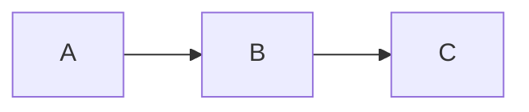
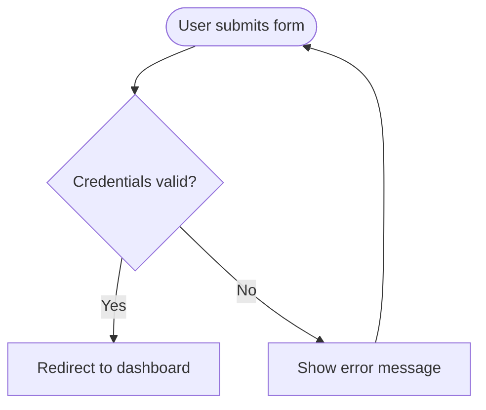
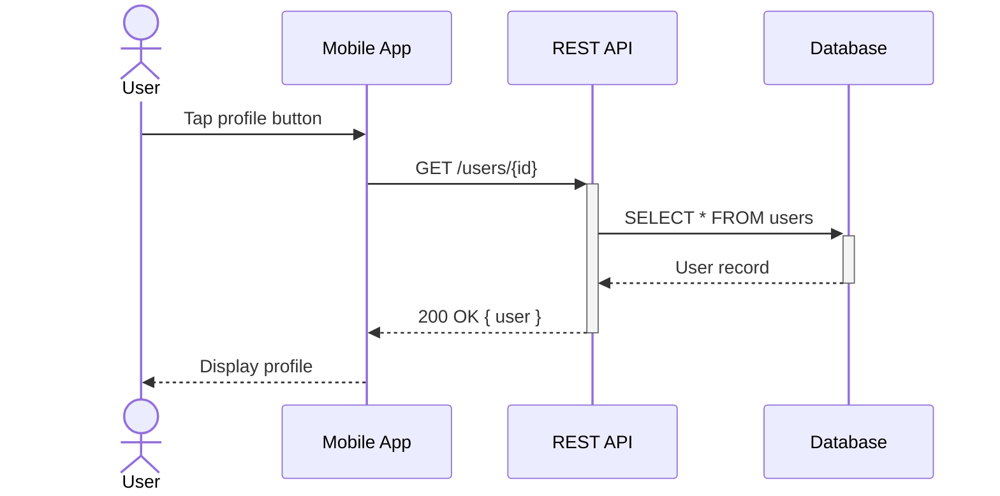
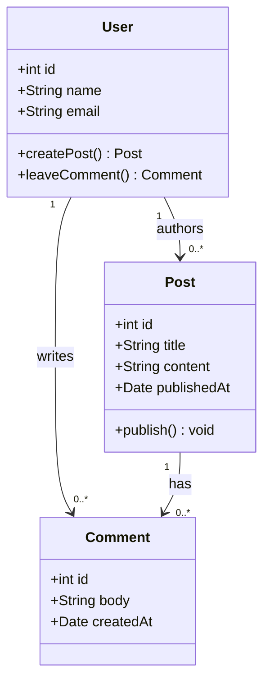
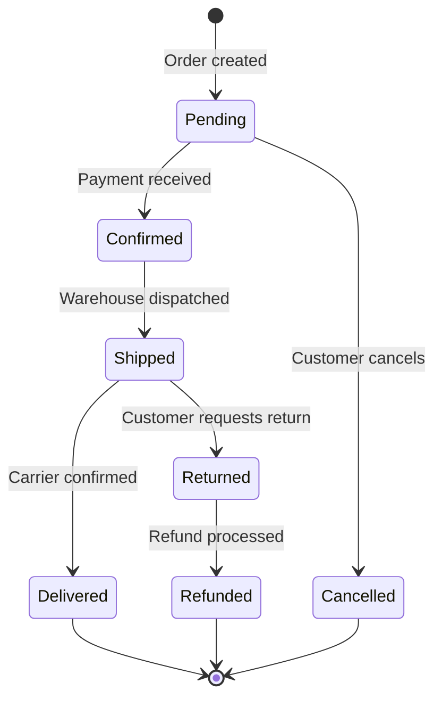
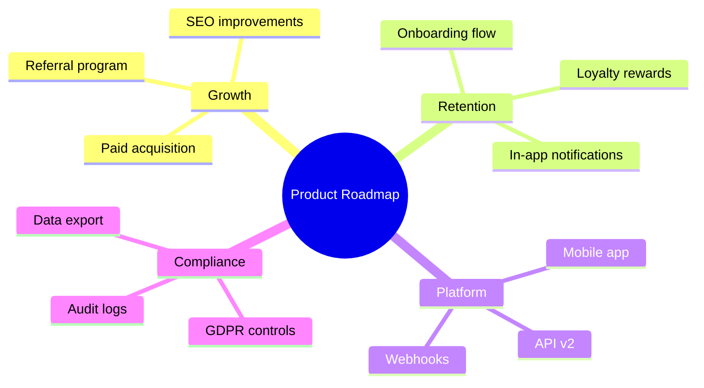

## Purpose

This skill translates verbal or written descriptions of processes, architectures, data models, timelines, and relationships into correct Mermaid diagram syntax. The output is a fenced code block using the `mermaid` language identifier, which renders natively in Obsidian, GitHub, GitLab, Notion, and any modern Markdown environment.

Mermaid is a text-based diagramming language. It allows diagrams to be version-controlled, diffed, and embedded directly in Markdown files without image uploads. This skill handles the translation from human intent to syntactically correct Mermaid DSL.

## When to Use

Invoke this skill when:

- The user asks to "draw", "create", "generate", or "diagram" something
- The user provides a process flow, system architecture, or data model in prose and wants a visual representation
- The user uploads or pastes an existing diagram image and wants its Mermaid equivalent
- The user says "add a diagram to this note" without specifying a tool
- The user explicitly mentions Mermaid, flowchart, sequence diagram, or any diagram type listed below
- The user asks to revise or extend an existing Mermaid diagram
- The user wants to visualize relationships between entities, steps in a process, or states in a system

Do NOT use this skill when:

- The user wants a hand-drawn or image-based diagram — Mermaid is text only
- The user needs interactive diagrams with click handlers — use a JavaScript library instead
- The user is working in Excalidraw — use `excalidraw-diagram` instead
- The user wants a whiteboard-style canvas layout — use `obsidian-canvas` instead

## Diagram Types Reference

| Type | Keyword | Best for |
|------|---------|---------|
| Flowchart | `flowchart TD` / `graph LR` | Step-by-step processes, decision trees |
| Sequence | `sequenceDiagram` | Interactions between actors over time |
| Class | `classDiagram` | Object-oriented models, data schemas |
| State | `stateDiagram-v2` | State machines, lifecycle flows |
| Entity Relationship | `erDiagram` | Database schemas, data models |
| Mindmap | `mindmap` | Topic hierarchy, brain dump structure |
| Gantt | `gantt` | Project timelines, sprint planning |
| Pie chart | `pie` | Proportional data visualization |
| Quadrant chart | `quadrantChart` | 2x2 priority or positioning matrices |
| Git graph | `gitGraph` | Branch and merge history |
| Timeline | `timeline` | Chronological event sequences |
| XY chart | `xychart-beta` | Bar and line chart data |

## Workflow

### Step 1: Identify the Diagram Type

Read the user's request and select the most appropriate diagram type:

- Processes with steps and decisions → `flowchart TD`
- Two or more actors exchanging messages → `sequenceDiagram`
- Classes, attributes, and methods → `classDiagram`
- Something that transitions between states → `stateDiagram-v2`
- Database tables and their relationships → `erDiagram`
- A hierarchy of topics or concepts → `mindmap`
- Tasks and dates on a timeline → `gantt`
- Proportions of a whole → `pie`

If the type is ambiguous, ask one clarifying question before generating: "What kind of diagram best fits your need — a flowchart, sequence diagram, or something else?"

### Step 2: Extract the Diagram Content

From the user's description, identify:

- **Nodes / entities**: the main components (steps, actors, classes, states)
- **Edges / relationships**: how nodes connect (arrows, labels, cardinality)
- **Subgroups**: clusters, swimlanes, namespaces, or parent-child hierarchies
- **Labels**: text on edges or inside nodes
- **Conditions**: decision branches in flowcharts (`Yes` / `No` labels)

### Step 3: Write Mermaid Syntax

Apply the correct syntax for the chosen diagram type. Output the diagram inside a fenced code block:

````markdown
```mermaid
<diagram code here>
```
````

#### Flowchart

```
flowchart TD
    A[Start] --> B{Decision}
    B -- Yes --> C[Process A]
    B -- No --> D[Process B]
    C --> E[End]
    D --> E
```

Node shapes:
- `[Text]` — Rectangle (process, step)
- `{Text}` — Diamond (decision)
- `(Text)` — Rounded rectangle (start/end)
- `((Text))` — Circle (connector)
- `[/Text/]` — Parallelogram (input/output)
- `[(Text)]` — Cylinder (database)

Direction modifiers: `TD` (top-down), `LR` (left-right), `BT` (bottom-top), `RL` (right-left).

Subgraphs for grouping:
```
flowchart TD
    subgraph Backend
        B1[API] --> B2[DB]
    end
    subgraph Frontend
        F1[UI] --> F2[State]
    end
    F2 -->|HTTP| B1
```

#### Sequence Diagram

```
sequenceDiagram
    actor User
    participant App
    participant DB

    User->>App: Submit form
    App->>DB: INSERT record
    DB-->>App: OK
    App-->>User: Success message
```

Arrow types:
- `->>`  — Solid arrow with head (synchronous call)
- `-->>`  — Dashed arrow with head (return / async)
- `->`   — Solid line, open arrow
- `-->`  — Dashed line, open arrow

Activate/deactivate to show processing time:
```
sequenceDiagram
    User->>+Server: Request
    Server-->>-User: Response
```

Notes in sequence diagrams:
```
Note right of User: User is logged in
Note over App,DB: Shared transaction
```

#### Class Diagram

```
classDiagram
    class User {
        +String name
        +String email
        -String password
        +login() bool
        +logout() void
    }

    class Order {
        +int id
        +Date createdAt
        +List~Item~ items
        +total() float
    }

    User "1" --> "0..*" Order : places
```

Visibility modifiers: `+` public, `-` private, `#` protected, `~` package/internal.

Relationship types:
- `-->` — Association
- `--|>` — Inheritance
- `..|>` — Implementation
- `--*` — Composition
- `--o` — Aggregation
- `..>` — Dependency

#### State Diagram

```
stateDiagram-v2
    [*] --> Idle
    Idle --> Processing : start
    Processing --> Success : complete
    Processing --> Failed : error
    Success --> [*]
    Failed --> Idle : retry

    state Processing {
        [*] --> Validating
        Validating --> Executing
        Executing --> [*]
    }
```

Use `[*]` for entry and exit points. Nested states model sub-processes.

#### Entity Relationship Diagram

```
erDiagram
    USER {
        int id PK
        string name
        string email UK
    }
    ORDER {
        int id PK
        int user_id FK
        date created_at
        float total
    }
    ORDER_ITEM {
        int order_id FK
        int product_id FK
        int quantity
    }
    USER ||--o{ ORDER : "places"
    ORDER ||--|{ ORDER_ITEM : "contains"
```

Cardinality notation:
- `||` — exactly one
- `o|` — zero or one
- `}|` — one or more
- `}o` — zero or more

#### Mindmap

```
mindmap
  root((Project))
    Planning
      Requirements
      Timeline
      Budget
    Execution
      Development
      Testing
      Deployment
    Review
      Metrics
      Retrospective
```

Nodes use indentation to define hierarchy. Root node uses `(( ))` for a circle. Child nodes can use `[ ]`, `( )`, or plain text.

#### Gantt Chart

```
gantt
    title Project Timeline
    dateFormat YYYY-MM-DD
    section Planning
        Requirements  :done, req, 2024-01-01, 2024-01-07
        Design        :active, design, 2024-01-08, 7d
    section Development
        Backend       :backend, after design, 14d
        Frontend      :frontend, after design, 14d
    section Launch
        Testing       :crit, test, after backend, 7d
        Deploy        :deploy, after test, 1d
```

Task modifier keywords: `done`, `active`, `crit` (critical path), `milestone`.

### Step 4: Validate the Syntax

Before outputting, mentally trace through the diagram and check:

1. **All referenced IDs exist** — every node ID used in an edge must be defined
2. **Subgraph closures** — every `subgraph` has a matching `end`
3. **Arrow syntax** — correct separator for the diagram type (`-->` vs `->>` vs `--|>`)
4. **Special characters** — node labels with parentheses, brackets, or quotes must use `["label with (parens)"]` to avoid parse errors
5. **No unsupported syntax** — mindmaps don't use arrows; ER diagrams use `||--o{` not `-->`

If you detect a likely syntax issue, note it explicitly: `⚠️ Note: The backslash in the label may need escaping — if the diagram fails to render, replace it with a hyphen.`

### Step 5: Provide Rendering Instructions

After the code block, briefly note how to render:

- **Obsidian**: The `mermaid` fence renders natively — no plugin required
- **GitHub / GitLab**: Renders in `.md` files and wikis
- **VS Code**: Install the "Mermaid Preview" extension
- **Browser**: Use [mermaid.live](https://mermaid.live) to paste and preview

If the skill detects the note is destined for Obsidian (user mentioned vault, note, or uses wikilinks), skip saying "Obsidian requires a plugin" — Mermaid is native to Obsidian.

## Output Formats

### Minimal Output

For a simple diagram request, output only the fenced code block:

````markdown

````

### Full Output

For complex diagrams where context helps, include:

1. A one-line description of what the diagram shows
2. The fenced Mermaid code block
3. Any notes about rendering or extension

### Embedded in a Note

When embedding in an Obsidian note, place the diagram after the relevant heading:

```markdown
## Architecture Overview


The system is composed of three layers...
```

## Critical Rules

**NEVER:**
- Output diagram syntax without the ```` ```mermaid ```` fence — the diagram will not render
- Mix diagram types in a single code block — use separate blocks for each diagram
- Use HTML tags inside Mermaid nodes — Mermaid has limited HTML support; use plain text
- Invent node IDs that don't match the connections — validate all references exist
- Add a `direction` keyword inside `classDiagram` — it is not supported in all Mermaid versions
- Use commas inside node labels without quoting: `A[Name, Title]` will break — use `A["Name, Title"]`

**ALWAYS:**
- Output the complete diagram, not a partial skeleton
- Pick the diagram type that best conveys the user's mental model, not the easiest to generate
- Include subgraph labels if the diagram has more than 8 nodes — group for readability
- Limit nodes to 20 or fewer in a single diagram; suggest splitting if the user's request is larger
- Test sequence diagram message labels — they appear above the arrow and must be concise
- Use `stateDiagram-v2` instead of the older `stateDiagram` — the v2 syntax is more expressive

## Example Usage

**Example 1: Process flowchart from description**

User: "Draw a flowchart for user login: user submits form, system checks credentials, if valid redirect to dashboard, if not show error"

Output:
````markdown

````

---

**Example 2: Sequence diagram for API interaction**

User: "Show the sequence when a mobile app calls our REST API to get user data"

Output:
````markdown

````

---

**Example 3: Class diagram for a data model**

User: "Create a class diagram for a blog post system with users, posts, and comments"

Output:
````markdown

````

---

**Example 4: State machine for order status**

User: "What are the states an order goes through from creation to delivery?"

Output:
````markdown

````

---

**Example 5: Mindmap for a brainstorming session**

User: "Create a mindmap for our product roadmap themes"

Output:
````markdown

````
